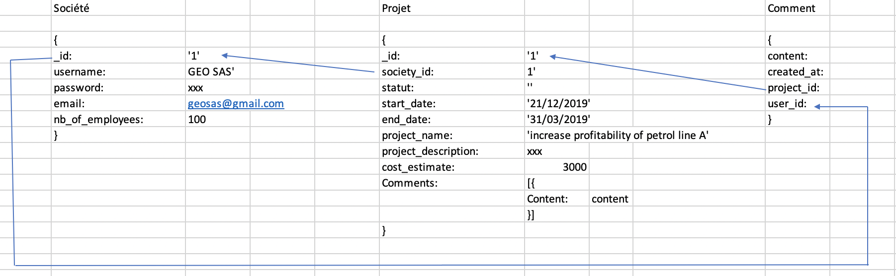

# Project 2 | LN Consulting - by Thao Nhu NGUYEN


## Overview
It's a website of a start-up finance consulting firm
- A company can see the services that we provide
- To have a cost estimate, a company has to signup and login
- That allows them to follow-up on the projects with us from cost estimate stage to delivery
- They can leave us comment on the project


## Logics
3 schemas

### User
```js
const UserSchema = Schema({
  username: String,
  email:    String,
  password: String,
  nb_of_employees: Number
});
```
### Project
```js
const ProjectSchema = Schema({
  project_name: String,
  project_description: String,
  company_id: {type: Schema.Types.ObjectId, ref: 'User'},
  start_date: Date,
  end_date:Date,
  cost_estimate:Number,
  status:{
    type:String,
    enum: ['Cost Estimate','Started', 'Interview', 'Development', 'Delivered']
  },
  comments:[{type: Schema.Types.ObjectId, ref: 'Comment'}]
});
```

### Comment
```js
const CommentSchema = Schema({
  content:String,
  created_at:{ type: Date, default: Date.now },
  project_id:{type: Schema.Types.ObjectId, ref: 'Project'},
  user_id:{type: Schema.Types.ObjectId, ref: 'User'},
});
```


